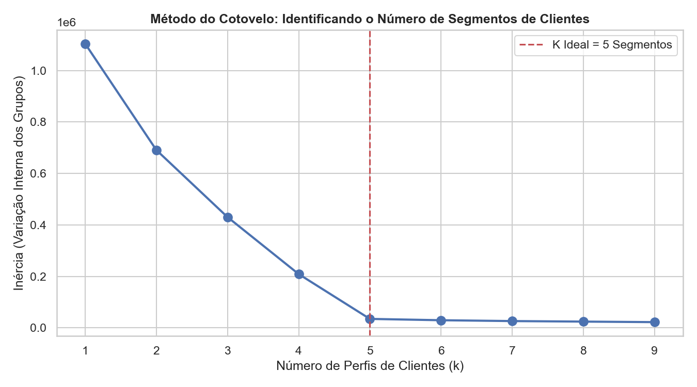
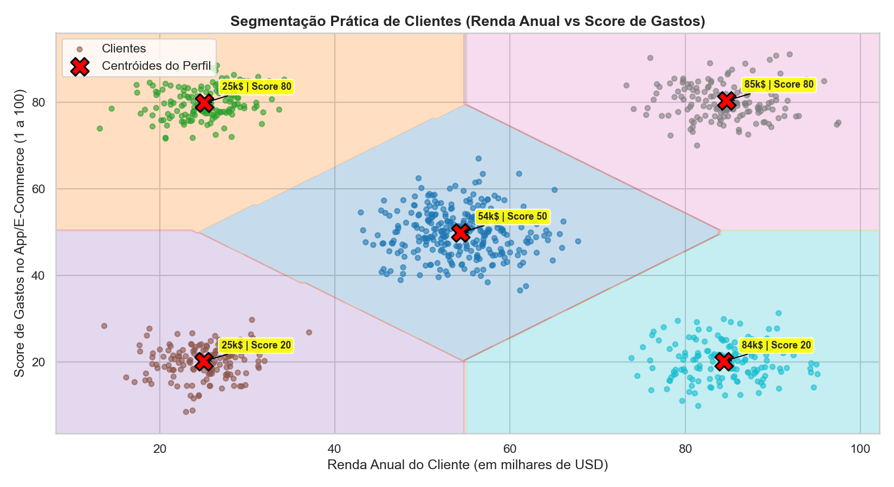
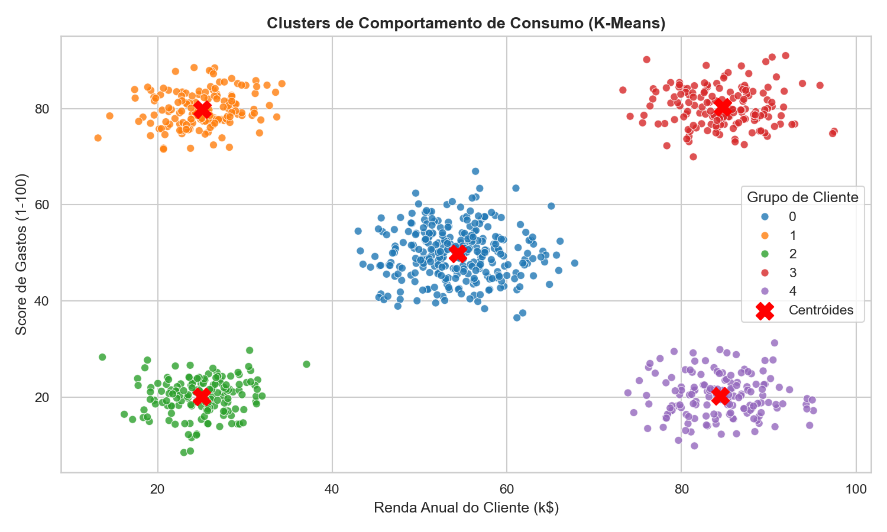

# 🤖 Machine Learning: Segmentação de Clientes de E-Commerce & Varejo (`K-Means`)

Este repositório contém um projeto prático de **Aprendizagem Não-Supervisionada (*Unsupervised Machine Learning*)** em Python, focado no agrupamento e descoberta de perfis de comportamento de consumidores utilizando o algoritmo **K-Means**.

---

## 📊 Natureza dos Dados

Diferente de datasets acadêmicos abstratos (como o famoso dataset *Iris* sobre espécies de flores), este projeto analisa **dados comportamentais de compras de clientes de varejo e e-commerce**.

O dataset analisa duas variáveis fundamentais do comportamento do consumidor:
1. **Renda Anual (`Renda_Anual_kUSD`)**: Faturamento/renda estimada do cliente em milhares de dólares ($k$).
2. **Score de Gastos (`Score_Gastos_1_100`)**: Pontuação atribuída pelo aplicativo/e-commerce (de 1 a 100) com base no histórico de engajamento, frequência de compras e ticket médio do usuário.

---

## 🔬 Como o Estudo Procedeu (Metodologia)

O estudo foi conduzido em 5 etapas encadeadas:

1. **Pré-processamento & Exploração**: Estruturação dos dados e verificação da distribuição espacial dos consumidores.
2. **Determinação do Número de Clusters ($K$)**: Aplicação da métrica de **Inércia** e do **Método do Cotovelo (*Elbow Method*)** para encontrar a quantidade ideal de personas sem gerar sobre-segmentação.
3. **Treinamento do Algoritmo K-Means**: Treinamento do modelo para agrupar os 2.000 clientes da base.
4. **Mapeamento Exato dos Centróides**: Cálculo das coordenadas matemáticas do ponto central de cada grupo ($X_1, X_2$), que definem o "cliente médio" de cada perfil.
5. **Validação Estatística & Conclusão de Negócio**: Avaliação da separação dos clusters pelo **Score de Silhueta (*Silhouette Score*)** e definição de estratégias de marketing para cada grupo.

---

## 📈 Resultados & Visualizações de Negócio

### 📐 1. Método do Cotovelo (Determinação das 5 Personas)


> **Resultado**: A queda da inércia reduz drasticamente a sua inclinação a partir de **$K = 5$**, indicando a divisão ideal do público-alvo em 5 segmentos distintos.

---

### 📍 2. Localização dos Centróides & Mapeamento de Perfis


> **Coordenadas dos Centróides (Perfil Médio de Cada Grupo)**:
> 1. 🟡 **Econômicos**: Renda ~25k$ | Score de Gastos ~20 *(Baixa renda, consumo baixo)*
> 2. 🔵 **Impulsivos / Promissores**: Renda ~25k$ | Score de Gastos ~80 *(Baixa renda, alto engajamento no app)*
> 3. 🟢 **Clientes Padrão**: Renda ~55k$ | Score de Gastos ~50 *(Renda e consumo equilibrados)*
> 4. 🟣 **Conservadores**: Renda ~85k$ | Score de Gastos ~20 *(Alta renda, baixo engajamento/gasto no app)*
> 5. 🔴 **Clientes VIP / Alvo**: Renda ~85k$ | Score de Gastos ~80 *(Alta renda e altíssimo ticket médio)*

---

### 📊 3. Clusters Finais de Consumidores


> **Métrica de Desempenho**: O modelo atingiu um **Score de Silhueta de 0.8037** (próximo do limite máximo 1.0), confirmando excelente coesão interna e forte separabilidade entre os perfis de clientes.

---

## 🛠️ Tecnologias & Ferramentas
- **Linguagem**: Python 3
- **Machine Learning**: `Scikit-Learn` (`KMeans`, `silhouette_score`)
- **Manipulação de Dados**: `Pandas`, `NumPy`
- **Visualização**: `Matplotlib`, `Seaborn`

---

## 📂 Estrutura do Repositório

```text
kmeans-clustering-scikit-learn/
├── README.md                                 <-- Apresentação completa do projeto
├── KMeans_Clusterizacao_ScikitLearn.ipynb   <-- Notebook formatado e documentado
├── kmeans_clustering.py                      <-- Script Python executável
├── elbow_method.png                          <-- Gráfico do método do cotovelo
├── centroids_boundaries.png                  <-- Coordenadas dos centróides e fronteiras
└── cluster_visualization.png                 <-- Visualização dos 5 clusters
```

---

## 🚀 Como Executar Localmente

```bash
# 1. Clonar o repositório
git clone https://github.com/victorauso/kmeans-clustering-scikit-learn.git

# 2. Instalar dependências
pip install scikit-learn pandas numpy matplotlib seaborn

# 3. Executar o script
python kmeans_clustering.py
```

---

## 🎓 Contexto Acadêmico
Projeto desenvolvido como aplicação prática na **Pós-Graduação em Ciência de Dados e Inteligência Artificial** (Universidade São Judas).

---

## 📬 Contato
- **Victor Oliveira**
- 💼 **LinkedIn:** [linkedin.com/in/victor-oliveira](https://www.linkedin.com/in/victor-oliveira)
- ✉️ **Email:** victorauso@gmail.com
